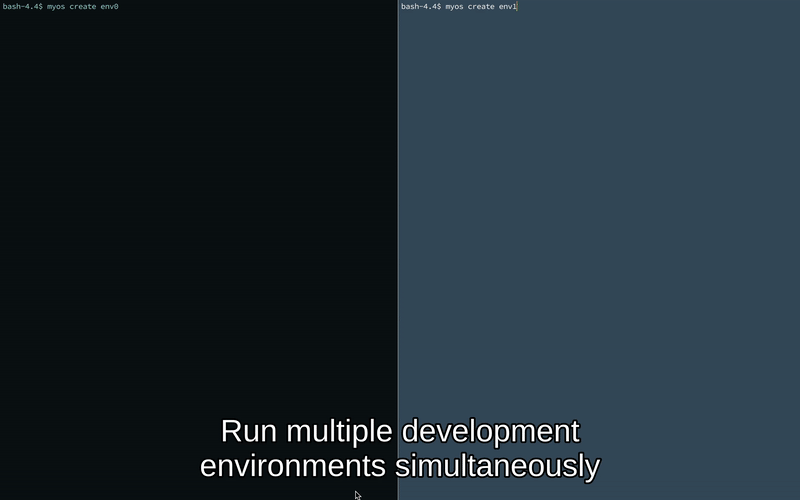

[](https://opensource.org/licenses/MIT) [](https://discord.gg/XXTvhdv)
# MyOS - Develop and Share Linux Environments

> If you like the project, please remember to star it so we can grow the community!



[Blog post about MyOS](https://cdevn.com/my-os) |      [Dockerhub](https://cloud.docker.com/repository/docker/rylandg/myos)

If you want your environment listed in the showcase, please submit a PR

## High Level

Uses Docker + Docker Compose to provide a consistent and reproducible build environment. Base image assumes the minimum while still being useful out of the box.

## Usage

### Assumptions

Everything depends on `myos` base Docker image. This image is available on Dockerhub, but you may also build it using the included Dockerfile.

> OSX Users: For display forwarding to work, you'll need to have [X11 Quartz](http://osxdaily.com/2012/12/02/x11-mac-os-x-xquartz/). It's crappy and I'd love to find an alternative.

> Ctrl-D is the most sure fire way of getting out of the container

### Setup

1. Clone the repo

    ```bash
    $ git clone https://github.com/rylandg/myos.git
    ```

1. Alias the CLI or add it to your `PATH`

    ```bash
    alias myos="/path/to/myos/repo/myos.sh"
    ```

1. Create a template environment with empty config files

    ```bash
    $ myos init ./somepath/
    $ ls somepath
      vim tmux zsh docker-compose.yml
    ```

1. Enter directory and create your environment

    ```bash
    $ cd somepath
    $ myos create testmyos 
    ```

1. Connect to the environment via ssh

    ```bash
    $ myos connect testmyos
    ```

1. Bring down the environment when you're done (this can lose data)

    ```bash
    $ myos remove testmyos
    ```

### Advanced usage

Assuming you've already installed the tool, my personal configuration can be used to test out MyOS.

1. Clone my personal MyOS config

```bash
$ git clone https://github.com/rylandg/rylandg-myosfiles
```

2. Create a MyOS based on my setup

```bash
$ cd rylandg-myosfiles
$ myos create rysetup
$ myos connect rysetup
```

## API

### Init
`myos init <dir>`

Creates the initial templates that the default `docker-compose.yml` expects. These are...

```bash
# vim
vim/binds.vim
vim/helpers.vim
vim/plugins.vim
vim/vimrc
# zsh
zsh/.zlogin
zsh/.zprofile
zsh/.zshenv
zsh/.zshrc
# tmux
tmux/tmux_saves
tmux/install_tmux.sh
tmux/tmux.conf
```

These files are empty (for the most part). You're expected to add your environment specific settings.

### Create
`myos create <envName>`

Runs `docker-compose up -d` from the current directory

### Connect
`myos connect <envName>`

Connects to a previously created MyOS environment


### Restart

`myos restart <envName>`

Restart a previously created MyOS environment

### Remove

`myos remove <envName>`

Remove a running MyOS environment

## Features

* Configuring locale and colors
* Creating a non-root user and setting necessary permissions
* Setups OpenSSH for password-less login
* Enabling X11 Display server
* Super light, highly optimized base Ubuntu image
* Mechanism to "safely" run multiple processes
* Init for running your user process as PID > 1
* OpenSSH server out of the box
* ZSH
* HTop
* Vim8 with clipboard support
* Latest Tmux built from source
* XAuth and XDisplay packages for clipboard support


## Issues/planned changes

* Very vim focused, would like to see if its possible to support other editors (definitely Emacs)
* Needs CLI command that allows you to copy another users MyOS environment
